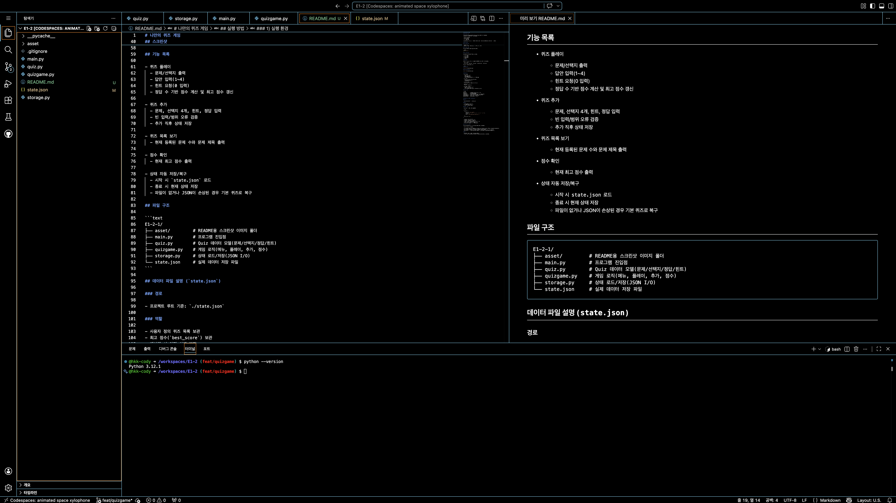
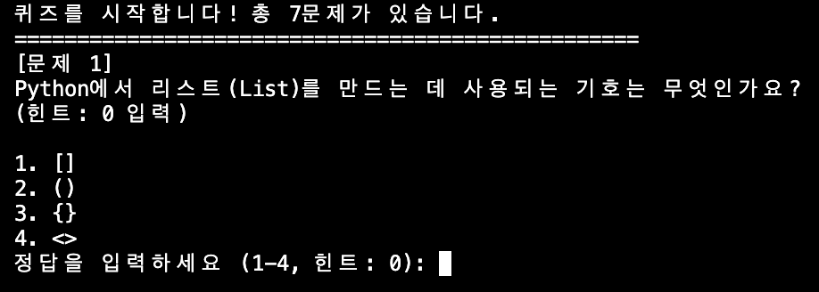
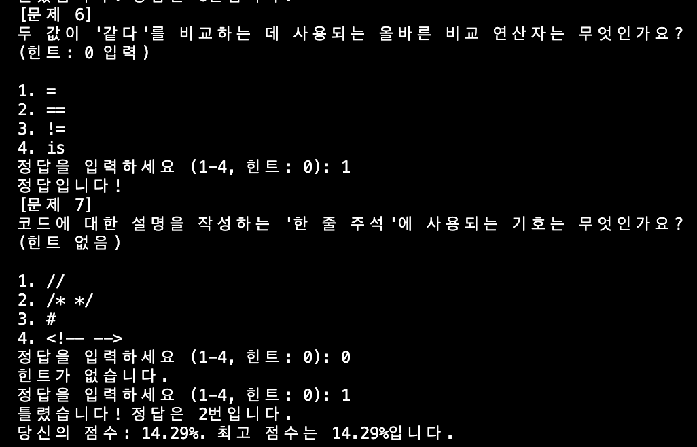
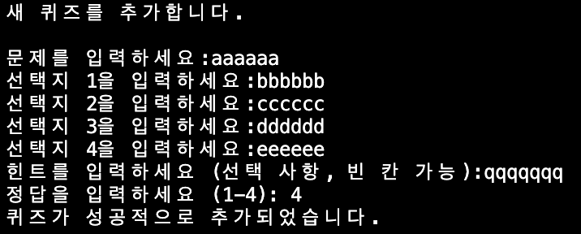
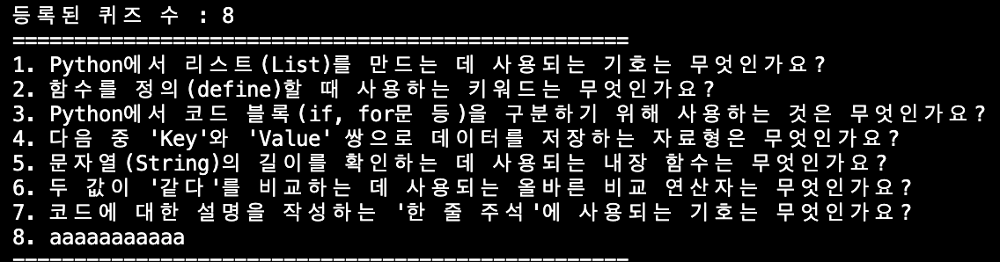
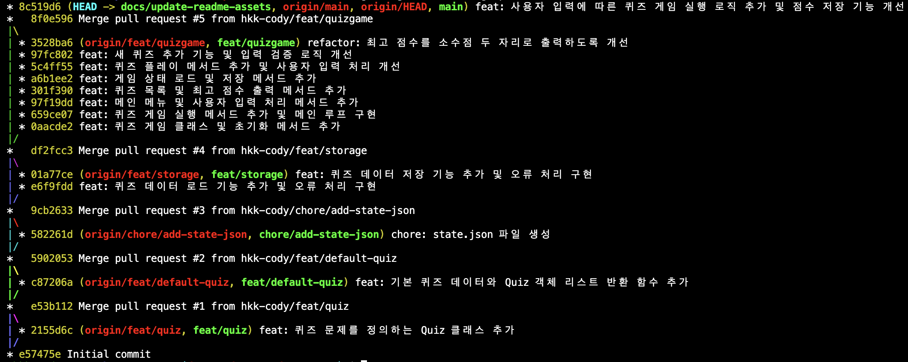

# 나만의 퀴즈 게임

## 프로젝트 개요

이 프로젝트는 터미널(콘솔)에서 실행되는 Python 기반 퀴즈 게임입니다.
사용자는 다음 기능을 이용할 수 있습니다.

- 등록된 퀴즈 풀기
- 새 퀴즈 추가
- 퀴즈 목록 확인
- 최고 점수 확인

게임 데이터(퀴즈 목록, 최고 점수)는 JSON 파일에 저장되어 프로그램을 다시 실행해도 유지됩니다.

## 실행 방법

### 1) 실행 환경

- Python 3.12
- 별도 외부 패키지 설치 없음(표준 라이브러리만 사용)

### 2) 실행 명령

프로젝트 루트에서 아래 명령을 실행합니다.

```bash
python main.py [state.json]
```

### 3) 메뉴 안내

프로그램 실행 후 아래 메뉴가 표시됩니다.

- 1: 퀴즈 풀기
- 2: 퀴즈 추가
- 3: 퀴즈 목록
- 4: 점수 확인
- 5: 종료

## 스크린샷

### vscode



### 퀴즈 진행 화면




### 퀴즈 추가 화면


### 퀴즈 목록 화면


### 최고 점수 화면


### git log --oneline --graph



## 기능 목록

- 퀴즈 플레이
  - 문제/선택지 출력
  - 답안 입력(1~4)
  - 힌트 요청(0 입력)
  - 정답 수 기반 점수 계산 및 최고 점수 갱신

- 퀴즈 추가
  - 문제, 선택지 4개, 힌트, 정답 입력
  - 빈 입력/범위 오류 검증
  - 추가 직후 상태 저장

- 퀴즈 목록 보기
  - 현재 등록된 문제 수와 문제 제목 출력

- 점수 확인
  - 현재 최고 점수 출력

- 상태 자동 저장/복구
  - 시작 시 `state.json` 로드
  - 종료 시 현재 상태 저장
  - 파일이 없거나 JSON이 손상된 경우 기본 퀴즈로 복구

## 파일 구조

```text
E1-2/
├── asset/         # README용 스크린샷 이미지 폴더
├── main.py        # 프로그램 진입점
├── quiz.py        # Quiz 데이터 모델(문제/선택지/정답/힌트)
├── quizgame.py    # 게임 로직(메뉴, 플레이, 추가, 점수)
├── storage.py     # 상태 로드/저장(JSON I/O)
└── state.json     # 실제 데이터 저장 파일
```

## 데이터 파일 설명 (`state.json`)

### 경로

- 프로젝트 루트 기준: `./state.json`

### 역할

- 사용자 정의 퀴즈 목록 보관
- 최고 점수(`best_score`) 보관
- 재실행 시 이전 상태 복원

### 필드 구조

`state.json`은 아래 구조를 가집니다.

```json
{
  "quizzes": [
    {
      "question": "문제 문자열",
      "choices": ["선택지1", "선택지2", "선택지3", "선택지4"],
      "answer": 1,
      "hint": "힌트 문자열(비어 있을 수 있음)"
    }
  ],
  "best_score": 80.0
}
```

- `quizzes`: 퀴즈 객체 배열
- `question` (string): 문제 텍스트
- `choices` (string[4]): 4개의 선택지
- `answer` (int): 정답 번호(게임 로직 기준 1~4)
- `hint` (string): 힌트(선택 입력)
- `best_score` (number): 최고 점수(백분율)

## 퀴즈 주제 선정 이유

본 프로젝트의 기본 퀴즈 주제는 Python 기초 문법과 개념입니다.

선정 이유는 다음과 같습니다.

- 학습 연계성: Python 학습 초반에 자주 접하는 핵심 개념(함수, 자료형, 연산자, 들여쓰기)을 복습하기 좋음
- 즉시 피드백: 정답/오답과 힌트를 통해 개념을 바로 확인할 수 있음
- 프로젝트 목적 부합: 콘솔 입력 처리, 데이터 저장, 예외 처리 등 Python 실습 요소와 잘 맞음

## 참고

- 프로그램은 종료 시 자동 저장을 수행합니다.
- `Ctrl+C` 또는 `입력 스트림 종료(EOF)` 상황에서도 안전 종료를 시도합니다.
